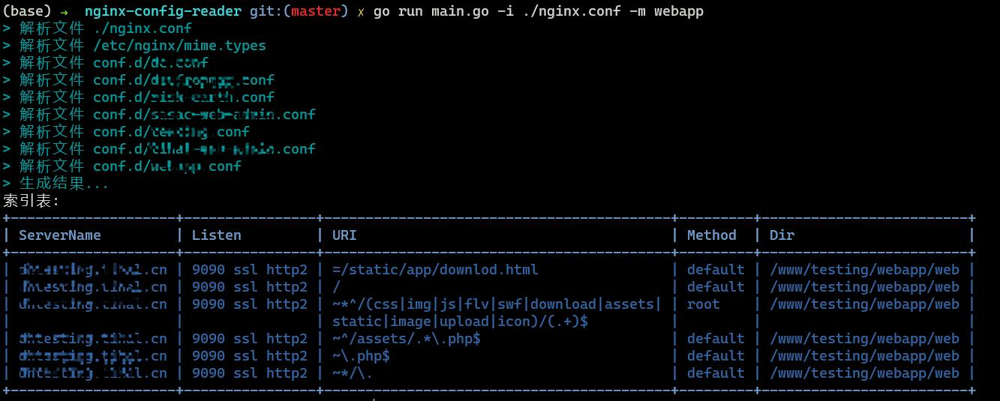

 <p align="center" >
   
 </p>

```
_|           _|    _|_|_|_|_|_|    _|_|_|_|_|_|
_| _|        _|    _|              _|         |
_|   _|      _|    _|              _|_|_|_|_|_|
_|     _|    _|    _|              _| _| 
_|        _| _|    _|              _|    _|
_|           _|    _|_|_|_|_|_|    _|       __|
```

# nginx-config-reader(ncr)

nginx 配置文件读取工具，用于快速预览当前服务下所有nginx配置文件


[English](./README_EN.md)

效果图


### 如何使用
有以下两种方案可供选择：

1. 下载已经编译好的可执行文件 [Release](https://github.com/ICU-Coders/nginx-config-reader/releases)

```shell
chmod o+x ./ncr-linux
./ncr-linux
```

2. 本地编译运行
```shell
go run ./main.go
```

### 可选参数
```
-i input 指定解析文件地址 
-l log 输出nginx配置log的位置
-s sort 排序server/listen/uri/dir 默认listen
-m match 匹配字符筛选
-h help 输出帮助内容
```

## MIT License

Copyright (c) 2022 ICU-Coders

Permission is hereby granted, free of charge, to any person obtaining a copy
of this software and associated documentation files (the "Software"), to deal
in the Software without restriction, including without limitation the rights
to use, copy, modify, merge, publish, distribute, sublicense, and/or sell
copies of the Software, and to permit persons to whom the Software is
furnished to do so, subject to the following conditions:

The above copyright notice and this permission notice shall be included in all
copies or substantial portions of the Software.

THE SOFTWARE IS PROVIDED "AS IS", WITHOUT WARRANTY OF ANY KIND, EXPRESS OR
IMPLIED, INCLUDING BUT NOT LIMITED TO THE WARRANTIES OF MERCHANTABILITY,
FITNESS FOR A PARTICULAR PURPOSE AND NONINFRINGEMENT. IN NO EVENT SHALL THE
AUTHORS OR COPYRIGHT HOLDERS BE LIABLE FOR ANY CLAIM, DAMAGES OR OTHER
LIABILITY, WHETHER IN AN ACTION OF CONTRACT, TORT OR OTHERWISE, ARISING FROM,
OUT OF OR IN CONNECTION WITH THE SOFTWARE OR THE USE OR OTHER DEALINGS IN THE
SOFTWARE.